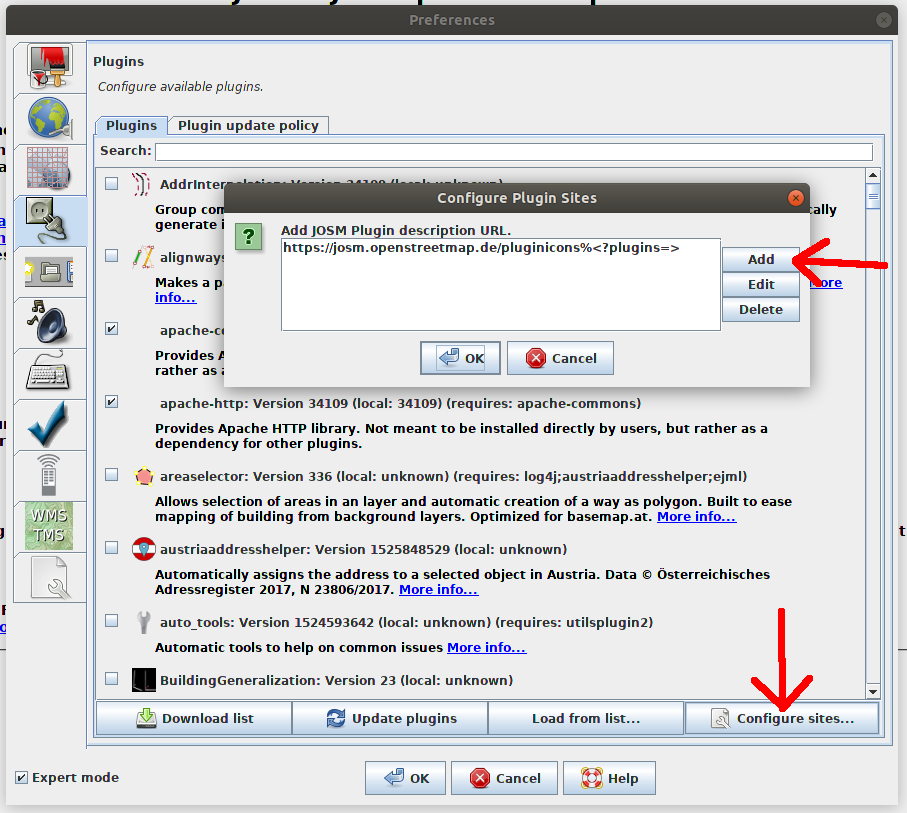

# JOSM plugin snapshot update site
Here is how you can install the current development version (not yet released, expect issues) of the `wikipedia` and the `pt_assistant` JOSM plugins:

1. Open any JOSM instance in which you want to try out these development versions.
2. Go to the preferences (e.g. hit `F12`).
3. Make sure the checkbox `Expert mode` in the bottom left corner of the preferences dialog is checked.
4. Go to the `Plugins` tab. Click on `Configure…` in the bottom right corner.

5. Then click on `Add` in the new dialog and enter the URL [https://josm.github.io/wikipedia/pluginMasterSnapshots](https://josm.github.io/wikipedia/pluginMasterSnapshots) and confirm with `OK`.
6. Now when you click `Download list`, you have two new plugins in the plugin list: `wikipedia-dev` and `pt_assistant-dev`. You can install these and they are updated like the "normal" JOSM plugins too.

> **Note:** Please make sure that you don't have both the dev and the non-dev version (e.g. `wikipedia` and `wikipedia-dev`) installed at the same time! This would probably lead to conflicts.

> **Another note:** The `pt_assistant-dev` plugin will always be redownloaded whenever you check for plugin updates. The `wikipedia-dev` plugin is only redownloaded when there is actually a new version available on the master branch.
